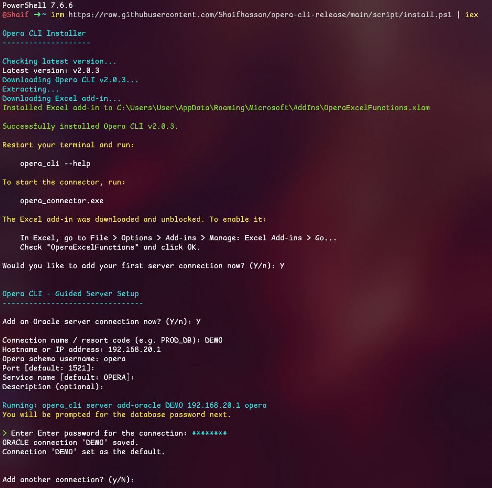
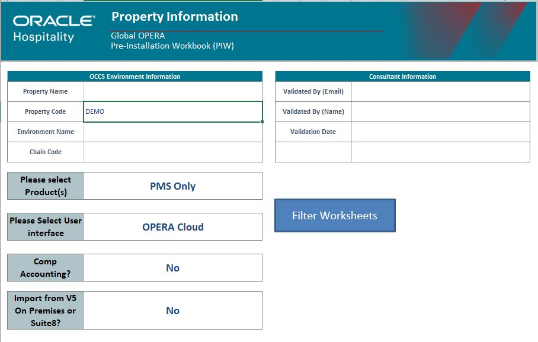
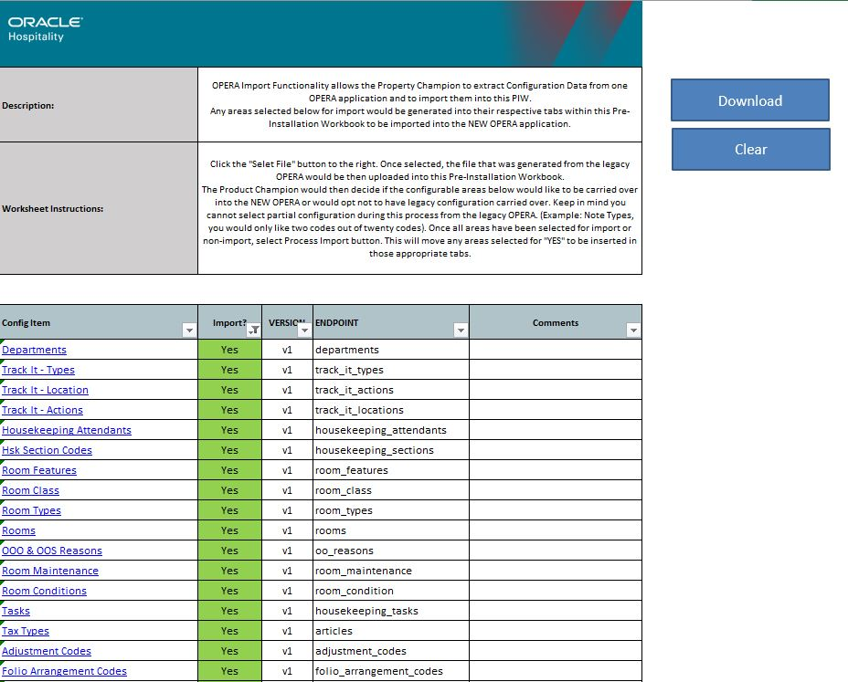

# HTM Global Pre-Installation Workbook

An Excel workbook used during OPERA PMS Cloud implementations. It extracts data from a legacy OPERA V5 database and uploads it into OPERA Cloud, replacing manual, error-prone data entry with a guided, repeatable import process.

> **Internal use only.** This document is for internal HTM use. It should not be distributed or used as a general implementation guide.

Users download the workbook, review and complete it, then hand it back for upload. The actual data download and upload to OPERA Cloud is carried out by the **HTM Support Team**.

## What this covers

- Installing the OPERA CLI Connector
- Connecting to the legacy OPERA database
- Downloading configuration into the workbook
- Supporting configuration reference
- Available endpoints and how to use them
- Adding custom endpoints

## Installation

The workbook relies on the **OperaExcel Connector** for database connectivity and data extraction.

### Guided install (recommended)

Run this in PowerShell to install the connector and walk through a guided self-hosted setup, including adding the Oracle connection:

```powershell
irm https://raw.githubusercontent.com/Shaifhassan/opera-cli-release/main/script/install.ps1 | iex
```



See the [Windows guided install guide](https://shaifhassan.github.io/opera-cli-release/#/getting_started/windows-guided-install) for details on what the script does.

### Advanced / manual setup

For manual setup, individual steps, or troubleshooting:

1. [Get started with the connector](https://shaifhassan.github.io/opera-cli-release/#/getting_started/getstarted)
2. [Set up the connector as self-hosted](https://shaifhassan.github.io/opera-cli-release/#/getting_started/self-hosted)
3. [Add the Oracle connection](https://shaifhassan.github.io/opera-cli-release/#/servers?id=add-oracle) — name the connection the same as the resort code you're connecting to
4. [Test the Oracle Connection](https://shaifhassan.github.io/opera-cli-release/#/servers?id=connect)
5. [Install the Excel add-in](https://shaifhassan.github.io/opera-cli-release/#/getting_started/excel-add-in)

## Usage

1. **Download the latest workbook** from the [releases page](https://github.com/Hospitality-Technology-Maldives/htm_global_pre_installation_workbook/releases).
2. Right-click the downloaded file, select **Properties**, then check **Unblock** before opening it.
3. Open the workbook in Excel and choose **Enable Macros** or **Enable Content** if Excel shows a security warning.
4. If macros are still disabled, enable them in Excel via **File > Options > Trust Center > Trust Center Settings > Macro Settings**, then reopen the workbook.
5. **Property Information sheet** — enter the Report Code as the connection identifier, along with the resort code.
   

6. **Opera Import sheet** — lists every worksheet available in the workbook.
   
   - Worksheets without a data extraction endpoint show `N/A` in the **Import?** column.
   - For the rest, choose **Yes** or **No** in the **Import?** column dropdown to select which modules/worksheets to import.

7. **Clear** — removes property-specific codes from sheets marked **Yes**. Recommended before importing a fresh resort.
8. **Download Data** — pulls data from each selected endpoint and appends it to the property-specific codes. Progress is reported per sheet in the **Import** worksheet.

Common statuses you may see: `Success`, `Error: No Data Found`, and various database errors.

## Customizing endpoints

Unhide all columns on the OPERA Import sheets to reveal the endpoint configuration.

Edit the **Endpoint Version** and **Endpoint** columns as needed.

## Adding a custom endpoint

1. Write a SQL query following the [fetch formula guide](https://shaifhassan.github.io/opera-cli-release/#/excel_formula/fetch), then add it to the connector service.
2. The query must include **no parameters, or exactly one** — `:1`, used for the resort filter. No other dynamic parameters are supported.
3. In the endpoint definition, set:
   - `Version` = `Custom`
   - `Endpoint` = the query file name, without file extension (e.g. `viplevels`)

## License

Released under the [MIT License](../LICENSE).
